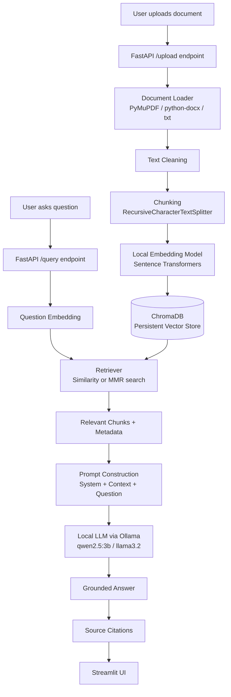

# RAG Document Q&A System

A complete, production-style **Retrieval-Augmented Generation (RAG)** application that lets you upload documents (PDF, DOCX, TXT) and ask natural-language questions about them — answered **only** from your documents, with source citations. Everything runs **locally**, using free and open-source tools only. No paid API keys, ever.

---

## 1. Project Overview

Traditional LLMs answer from what they memorized during training — which means they can be outdated, wrong, or make things up ("hallucinate") when asked about your private documents. This project solves that with RAG:

1. Your documents are split into small chunks and converted into vector embeddings.
2. When you ask a question, the system finds the most relevant chunks using semantic search.
3. Those chunks (not the whole document) are handed to a local LLM as context.
4. The LLM is instructed to answer **using only that context** and to say so explicitly when the answer isn't in the documents.
5. Every answer comes with citations back to the source document and page.

This keeps answers grounded, verifiable, and free of hallucination on facts not present in your documents.

---

## 2. Architecture Diagram



---

## 3. Features

- Upload PDF, DOCX, and TXT documents
- Configurable chunking (size, overlap) via environment variables
- Local embeddings with Sentence Transformers (no API key)
- Persistent vector storage with ChromaDB
- Duplicate document detection (via content hash)
- Both plain semantic similarity search **and** MMR retrieval
- Fully local LLM generation via Ollama
- Strict grounding: the model must say when an answer isn't in the documents
- Source citations (document name + page number) for every answer
- FastAPI backend with clean REST endpoints
- Streamlit chat-style frontend with conversation history
- Document management (list/delete) from the sidebar
- Local, transparent evaluation script (Recall@K, context relevance, faithfulness, answer accuracy)
- Dockerized (backend, frontend, and Ollama)
- Unit tests with pytest
- Clear, user-friendly error handling throughout

---

## 4. Technology Stack

| Layer            | Technology                                   |
|-------------------|-----------------------------------------------|
| Backend API        | FastAPI + Pydantic                            |
| Frontend           | Streamlit                                     |
| Orchestration      | LangChain (text splitting)                    |
| Embeddings         | Sentence Transformers (`all-MiniLM-L6-v2`)    |
| Vector Database    | ChromaDB (persistent, local)                  |
| LLM                | Ollama (`qwen2.5:3b`, `llama3.2`, or similar)  |
| PDF parsing        | PyMuPDF                                       |
| DOCX parsing       | python-docx                                   |
| Containerization   | Docker + docker-compose                       |
| Testing            | pytest                                        |

Everything above is free and runs entirely on your machine.

---

## 5. How RAG Works (short version)

RAG = **Retrieval** + **Augmented Generation**.

- **Retrieval**: instead of relying on the LLM's frozen training data, we search a vector database of your document chunks for the pieces most semantically similar to the question.
- **Augmentation**: those chunks are inserted into the prompt as "context."
- **Generation**: the LLM generates an answer conditioned on that context, with explicit instructions not to use outside knowledge.

This project uses two retrieval strategies:
- **Similarity search**: returns the top-K most similar chunks.
- **MMR (Maximum Marginal Relevance)**: returns chunks that are both relevant *and* diverse, avoiding returning five near-duplicate chunks and missing other important context. MMR first fetches `FETCH_K` candidates by similarity, then greedily selects `TOP_K` of them balancing relevance against redundancy, controlled by `LAMBDA_MULT` (1.0 = pure relevance, 0.0 = pure diversity).

---

## 6. Installation

### Prerequisites
- Python 3.11+
- [Ollama](https://ollama.com) installed locally (see section 7)
- ~4GB free disk space for a small local model

### Steps

```bash
git clone <your-repo-url> rag-document-qa
cd rag-document-qa

python -m venv venv
source venv/bin/activate        # Windows: venv\Scripts\activate

pip install -r requirements.txt

cp .env.example .env            # adjust values if needed
```

---

## 7. Ollama Installation

Ollama runs the LLM locally — no API key required.

**macOS / Linux:**
```bash
curl -fsSL https://ollama.com/install.sh | sh
```

**Windows:** download the installer from https://ollama.com/download

Start the Ollama server (if it isn't already running as a service):
```bash
ollama serve
```

## 8. Model Installation

Pull a small, free instruct model (pick one and match it to `OLLAMA_MODEL` in `.env`):

```bash
ollama pull qwen2.5:3b
# or
ollama pull llama3.2
```

Verify it's available:
```bash
ollama list
```

---

## 9. Running Locally

**Terminal 1 — start Ollama (if not already running):**
```bash
ollama serve
```

**Terminal 2 — start the FastAPI backend:**
```bash
uvicorn app.main:app --reload --host 0.0.0.0 --port 8000
```

**Terminal 3 — start the Streamlit frontend:**
```bash
streamlit run frontend/streamlit_app.py
```

Then open http://localhost:8501 in your browser. The API docs are available at http://localhost:8000/docs.

---

## 10. Running with Docker

This spins up Ollama, the FastAPI backend, and the Streamlit frontend together.

```bash
docker compose up --build
```

Then, in a separate terminal, pull the model **into the Ollama container** (Docker cannot magically have a model that hasn't been downloaded):

```bash
docker exec -it rag_ollama ollama pull qwen2.5:3b
```

Once pulled, open:
- Frontend: http://localhost:8501
- Backend docs: http://localhost:8000/docs

---

## 11. API Documentation

| Method | Endpoint                  | Description                          |
|--------|-----------------------------|----------------------------------------|
| POST   | `/upload`                   | Upload and index a document           |
| POST   | `/query`                    | Ask a question about indexed documents|
| GET    | `/documents`                 | List indexed documents                |
| DELETE | `/documents/{document_id}`  | Delete an indexed document             |
| GET    | `/health`                    | Health check (Ollama + model + store) |

Interactive Swagger docs: `http://localhost:8000/docs`

### Example: upload
```bash
curl -X POST http://localhost:8000/upload -F "file=@sample.pdf"
```

### Example: query
```bash
curl -X POST http://localhost:8000/query \
  -H "Content-Type: application/json" \
  -d '{"question": "What is the main conclusion of the document?", "mode": "mmr", "top_k": 5}'
```

---

## 12. Example Usage

1. Create a simple test file, `sample.txt`:
   ```
   Acme Corp reported total revenue of $4.2 million in 2025, an increase of 18% over 2024.
   The board approved a new product line focused on renewable energy storage.
   The main conclusion of the annual report is that diversification into energy storage
   is expected to drive growth through 2026.
   ```
2. Upload it via the Streamlit sidebar or `curl -X POST http://localhost:8000/upload -F "file=@sample.txt"`.
3. Ask: *"What was the revenue in 2025?"* → should answer "$4.2 million" with a citation to `sample.txt`.
4. Ask: *"What is the CEO's favorite color?"* → should respond that this isn't in the uploaded documents, since that information was never provided.

---

## 13. Evaluation Methodology

Run:
```bash
python evaluation/evaluate.py
```

This requires the backend + Ollama to be running, and the documents referenced in `evaluation/dataset.json` to actually be uploaded first. Edit `dataset.json` to match real documents and expected answers before running.

Metrics computed (all local, no paid LLM judge):

- **Retrieval Recall@K** — was the expected document/page among the top-K retrieved chunks?
- **Context Relevance** — fraction of expected keywords found in the retrieved context.
- **Faithfulness/Grounding** — fraction of the generated answer's words that also appear in the retrieved context (a proxy for hallucination — higher is better).
- **Answer Accuracy** — fraction of expected keywords found in the generated answer.

These are intentionally simple, transparent, keyword/overlap-based metrics rather than an LLM-as-judge, since an LLM judge would typically require another (often paid) model. This is a known limitation — see below.

---

## 14. Limitations

- Keyword-overlap evaluation metrics are a simple proxy, not a semantic judge; they can under- or over-estimate quality on paraphrased answers.
- DOCX files have no native page concept, so citations for DOCX are reported without page numbers.
- Small local LLMs (3B parameters) are less capable than large hosted models; answer quality depends heavily on which Ollama model you choose.
- No authentication/multi-user isolation — this is a single-user local system as built.
- Very large documents may take noticeably longer to embed on CPU-only machines.

## 15. Future Improvements

- Add hybrid search (BM25 + vector) for better keyword-heavy queries.
- Add LLM-based (still local) answer evaluation using a second local model as judge.
- Add streaming responses from Ollama for a more responsive UI.
- Add user authentication and per-user document isolation.
- Support additional formats (PPTX, HTML, Markdown) via the pluggable loader registry.
- Add re-ranking with a cross-encoder model for higher precision retrieval.

---

## Project Structure

```
rag-document-qa/
├── app/
│   ├── main.py                 # FastAPI app entrypoint
│   ├── config.py                # Centralized environment-based config
│   ├── exceptions.py            # Custom exception types
│   ├── schemas.py                # Pydantic request/response models
│   ├── api/
│   │   ├── routes_documents.py  # upload/list/delete endpoints
│   │   └── routes_query.py      # query/health endpoints
│   ├── ingestion/
│   │   ├── loaders.py            # PDF/DOCX/TXT loaders
│   │   ├── chunking.py           # text splitting
│   │   └── metadata.py           # hashing / ID helpers
│   ├── embeddings/
│   │   └── embedding_model.py    # local Sentence Transformers wrapper
│   ├── vectorstore/
│   │   └── chroma_store.py       # ChromaDB wrapper (CRUD + search + MMR)
│   ├── retrieval/
│   │   └── retriever.py          # similarity/MMR retrieval orchestration
│   ├── llm/
│   │   ├── ollama_client.py      # local LLM calls
│   │   └── prompts.py            # RAG prompt templates
│   └── services/
│       └── rag_pipeline.py       # end-to-end orchestration
├── frontend/
│   └── streamlit_app.py
├── evaluation/
│   ├── dataset.json
│   └── evaluate.py
├── data/
│   ├── uploads/
│   └── chroma/
├── tests/
├── Dockerfile
├── docker-compose.yml
├── requirements.txt
├── .env.example
└── README.md
```

---

## How to Verify RAG Retrieval Is Actually Working

1. Upload a document with a very specific, uncommon fact (e.g., a made-up statistic).
2. Ask a question that can only be answered from that fact.
3. Expand "Show retrieved passages" in the UI (or check `retrieved_passages` in the `/query` response) — confirm the exact chunk containing that fact was retrieved.
4. Ask an unrelated question with no answer in your documents — confirm the system responds with "I couldn't find this information in the uploaded documents." instead of guessing.
5. Delete the document and ask the same question again — confirm the answer changes to "not found," proving the answer really came from that document and not the LLM's memory.

## How to Measure Retrieval Performance

Use `evaluation/evaluate.py` (Section 13) for automated Recall@K, context relevance, faithfulness, and accuracy metrics on a labeled dataset. For ad-hoc checks, inspect the `similarity` score returned per chunk in `/query` responses — cosine similarity closer to 1.0 indicates a stronger semantic match.

## Discussing This Project in an Interview

Be ready to explain:
- **Why RAG over fine-tuning**: RAG updates knowledge instantly (just re-index), is cheaper, and is auditable via citations; fine-tuning bakes knowledge into weights and is harder to update/verify.
- **Chunking trade-offs**: smaller chunks improve retrieval precision but lose context; larger chunks preserve context but dilute relevance and increase prompt size. Overlap mitigates losing information at chunk boundaries.
- **Why MMR**: pure similarity search can return many near-duplicate chunks from one section of a document; MMR trades off some relevance for diversity so the LLM sees a broader, less redundant context.
- **Grounding strategy**: the system prompt explicitly forbids outside knowledge and mandates an "I don't know" fallback, plus prompt-injection guarding for text embedded in uploaded documents.
- **Why local models**: zero cost, data privacy (nothing leaves your machine), no rate limits — at the cost of lower capability compared to large hosted frontier models.
